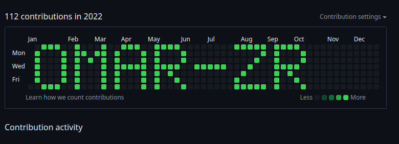

Creating a README file for your GitHub repository to explain your tool is a great idea. Below is an example of a README file that provides instructions on how to use your tool for drawing names on Git activity, including setting the name variable and specifying the starting date (first Sunday of the year):

---

# Git Activity Name Drawer

This tool allows you to draw your name on your GitHub activity graph by simulating commits on specific days.

### How to Use

1. **Clone the Repository:**

   ```bash
   git clone https://github.com/your-username/git-activity-name-drawer.git
   cd git-activity-name-drawer
   ```

2. **Set Up the Tool:**

   - Open `char_patterns.py` in a text editor, make sure all characters of your name are there.
   
   - Run `char_patterns.py`  to Generate new `char_patterns.json` that contains the chars of your name.

   - Opn `draw.py` and change `input_string` to be your name.

   - Specify the starting date (`start_date`) as the first Sunday of the year you want to draw on. Example: `start_date = "2024/01/07"` for the year 2024.

3. **Run the Script:**

   ```bash
   python draw.py
   ```

   - This script will simulate commits for each day that corresponds to a 1 in the drawn pattern.

4. **Push Changes to GitHub:**

   ```bash
   git push origin main git@github.com:YOUR-USER/YOUR-REPO.git
   ```

   - Push the changes to your GitHub repository.

5. **Check Your GitHub Profile:**

   - Visit your GitHub profile and navigate to the activity graph to see your name drawn, like below.
   

### Contribution

Contributions are welcome! If you have any improvements or suggestions, feel free to fork the repository and submit a pull request.

### License

This project is licensed under the MIT License - see the [LICENSE](LICENSE) file for details.

---

### Notes:

- **Adjustments**: Make sure to adjust the instructions and example code in the README file according to the specific implementation of your `draw_name.py` script.

- **License**: Ensure to include a `LICENSE` file in your repository that specifies the terms under which others can use, modify, and distribute your project.

This README file provides a clear and concise guide for users to set up and use your tool for drawing names on the GitHub activity graph. Adjust the details and instructions based on your specific implementation and preferences.